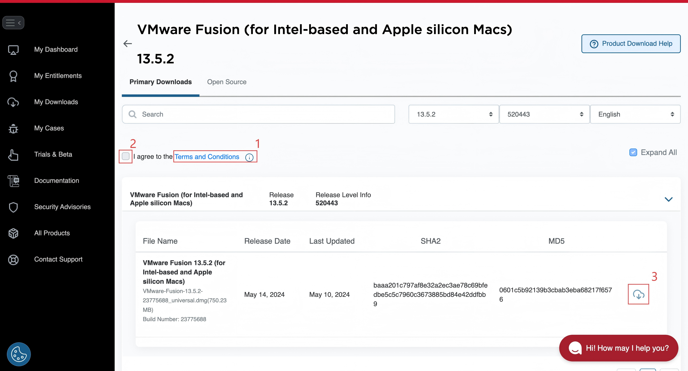

# Lab 1 - Web Security Attack

In this lab, you will complete the XSS web attack lab tasks from the SEED Labs. You will learn to code and attack a vulnerable social media application installed in a VM. Coding experience is recommended, so you might want to work with someone with relevant backgrounds.

## Environment Setup

> [!IMPORTANT]
> If your laptop runs into VM issues, you can always do the lab on the **MSSI Lab** computers. First **activate your ISI/MSSI account**: https://wiki.isi.jhu.edu/index.php/MSSI_Accounts. For details, see Christopher Venghaus’s email titled **“MSSI Account Information.”**

### Intel/AMD Machines x86-64
1. Follow SEED’s [**VM manual for VirtualBox**](https://github.com/seed-labs/seed-labs/blob/master/manuals/vm/seedvm-manual.md) to download & install VirtualBox and get the pre-built Ubuntu 20.04 x86-64 VM.
2. Start the VM and log in with the credentials shown on the SEED Lab Environment Setup page.  
3. Download the **Labsetup.zip** from the [lab page](https://seedsecuritylabs.org/Labs_20.04/Web/Web_XSS_Elgg/). You can download it directly on the VM or download it on your host machine and transfer it to the VM using the shared folder feature of VMware Fusion. **Unzip the setup file** and start your lab.

### Apple Silicon Machines ARM64
1. Follow SEED’s [**Fusion installation guide for Apple Silicon**](https://github.com/seed-labs/seed-labs/blob/master/lab-setup/apple-arm/seedvm-fusion.md) to download & install VMware Fusion (Apple Silicon) and get Ubuntu 22.04 ARM64.
   
   > On Broadcom’s download page, if **Download** is disabled, click **Terms and Conditions** → check **I agree** → try again.
   > 
2. Start the VM and log in with the credentials shown in the SEED lab setup page.  
3. Download **Labsetup-arm.zip** from the [lab page](https://seedsecuritylabs.org/Labs_20.04/Web/Web_XSS_Elgg/). You can download it directly on the VM or download it on your host machine and transfer it to the VM using the shared folder feature of VMware Fusion. **Unzip the setup file** and start your lab.

## Cross-Site Scripting (XSS) Attack Lab

Please thoroughly read the [lab instructions](https://seedsecuritylabs.org/Labs_20.04/Files/Web_XSS_Elgg/Web_XSS_Elgg.pdf) and complete all the tasks listed in it. We recommend you first go through all the instructions before you start. You need to write a detailed report with adequate screenshots and explanations, including your code and demonstration that your attacks are successful. An example is given for what it would look like.

In addition, please answer the following questions:

1. In 3.2 task 1, why can we pop up a window using the first sample code provided in 3.2 Task 1? Please explain briefly how this happens. Is such an attack still possible in today's mainstream browsers? (To answer this question, you may need to search for any useful resources by yourself, and remember to provide the relevant evidence/references below.)

2. In 3.3 task 2, If your operation is correct, you will be able to see a "cookie" in the window that pops up. Please briefly explain why the code you add in this task allows you to see this "cookie".

## Submission Details

- Each group only needs to submit one report in PDF format.
- Please list group members in your report explicitly and each member's contribution.
- Only typed reports are accepted.
- Please ensure that you answer both the questions provided on this page (above) and those outlined in the lab instruction PDF.

## Grading

- Completeness (25 pts): All the steps as instructed in the lab manual must be included in the report with adequate evidence.
- Presentation (15 pts): The report must be clear and correct in organization and writing with adequate explanation.
